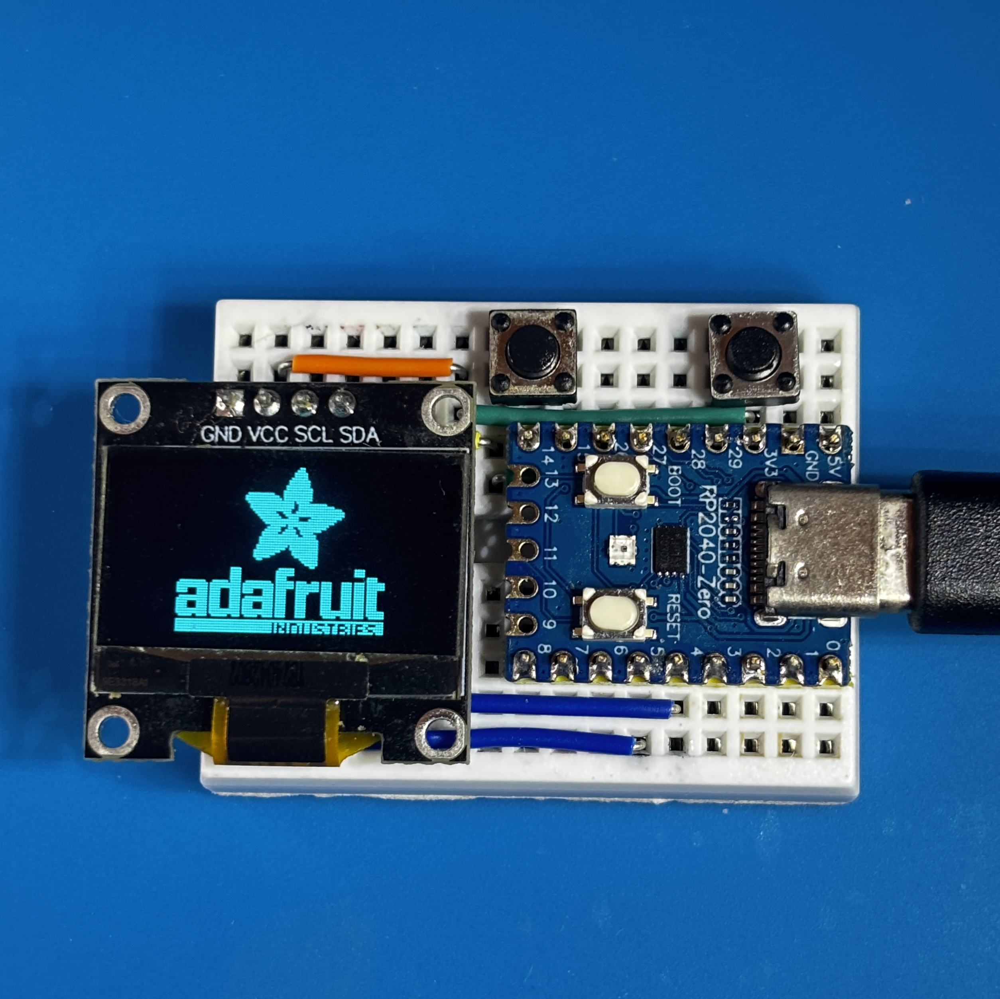

# Arduino: RP2040-OLED-SSD1306-I2C-Tester

RP2040-Zero を使用した OLED テスタです。

## 部材

- RP2040-Zero 1個
- ミニブレッドボード 1個
- ジャンパーワイヤ 14本
- SSD1306 OLED モジュール 1個
- タクトスイッチ 2個

## 接続

| デバイス | ピン | RP2040 ピン |
|---|---|---|
| SSD1306 OLED | GND | GND |
| SSD1306 OLED | VCC | 3V3 |
| SSD1306 OLED | SDA | GPIO 4 |
| SSD1306 OLED | SCL | GPIO 5 |
| タクトスイッチ1 | 1 | GND |
| タクトスイッチ1 | 2 | GPIO15 |
| タクトスイッチ2 | 1 | GPIO29 |
| タクトスイッチ2 | 2 | GND |

### 配線図

## 開発環境

- IDE: Arduino IDE
- ボード: Raspberry Pi Pico/RP2040
- ライブラリ:
    - `Adafruit GFX Library`
    - `Adafruit SSD1306`

## ライセンス

このプロジェクトは [MIT ライセンス](./LICENSE) の下で公開されています。
自由に使用、改変、再配布していただけます。
